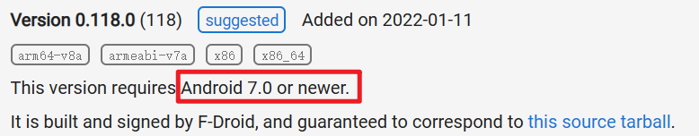
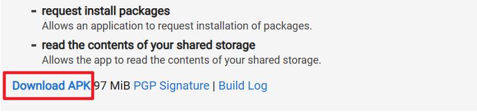
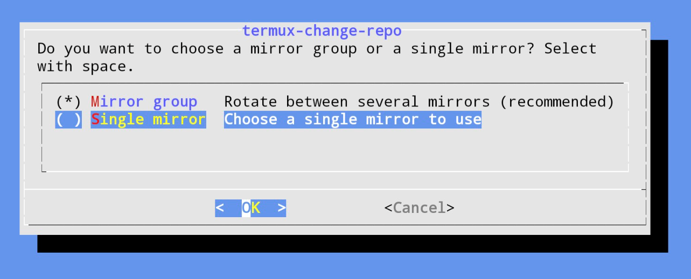
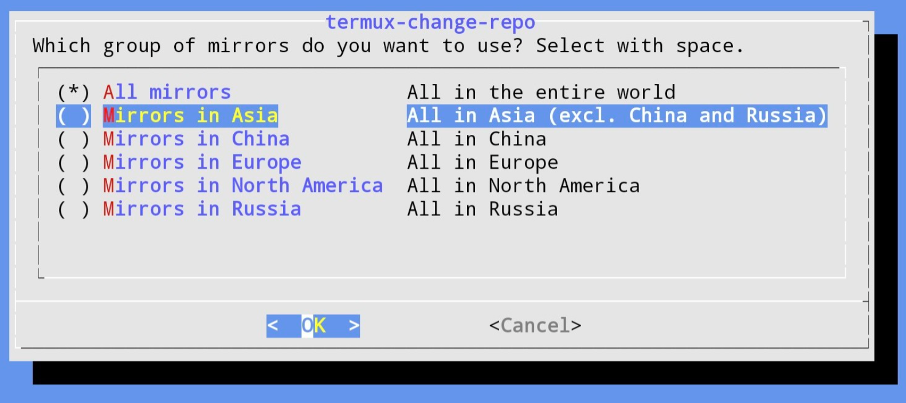

# 如何在平板中安装Termux


## 一、Termux介绍

由于Android是基于Linux开发的系统，却没有终端机。 而Termux这个开源终端机模拟器补全了这个缺口，不需要Root就可以使用，还有自己的套件管理员。Termux可以跑SSH连线、视频转档、跑电脑的软件、架服务器、学习写程序等等。

## 二、Termux安装

Google Play上的Termux已经没在更新了，请到[F-Droid](https://f-droid.org/en/packages/com.termux/)下载最新版。

Termux要求系统为Android 7以上的Android设备。



点击`Download APK`下载安装文件。



然后将安装包上传到平板上安装即可。

1. 更新软件套件（若更新报错则先更换镜像站点，然后再进行更新，然后再切换镜像站点）

   ```bash
   pkg update
   ```

2. 询问是否要升级，全都选择`y`即可

3. 切换镜像站点

   ```bash
   termux-change-repo
   ```

4. 按键盘上下键切换到 `Single mirror`，再按下Enter确认。

   

5. 选择`Mirrors in China`，按下Enter确认。

   

## 三、Termux配置使用

更新软件套件和切换镜像站点等操作参考[Termux使用教学：Android手机跑Linux指令 | Ivon的博客 (ivonblog.com)](https://ivonblog.com/posts/how-to-use-termux/)

