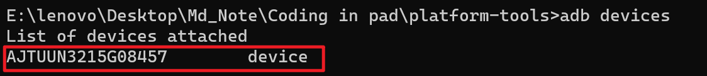

# 如何防止防止Termux被系统杀死

## 一、既有教程必有原因

Android12系统将会监控APP所fork出来的子行程，并在达到32个以上子行程后将其终止，避免占用过多CPU资源。此一机制称为“Phantom Processes Killing”，因为开发者最害怕看到这种情况，得名影子行程杀手。

## 二、解决方法

要解决Termux的崩溃问题，执行指令将Phantom Processes Killing停用即可，虽然会导致某些APP的背景进程跟着不受控制，但是这无伤大雅。

大部分Android设备皆有安装Google Play服务框架，因为GMS会不定时覆盖设备设定，所以要一并将其关闭。 然而关闭GMS覆盖可能会导致手机卡开机，风险自负。但是荣耀平板V8Pro没有Google Play服务框架，所以这无需操作。

以下为荣耀平板V8Pro（未root）停用Phantom Processes Killing的操作步骤（需要使用电脑）：

1. 到Android官网[下载](https://developer.android.com/studio/releases/platform-tools)对应版本的Platform Tools，我这里使用Windows版，解压缩。

   

2. 进入`platform_tools`目录，会看到ADB和Fastboot的执行文件。 在这里按SHIFT + 右键，开启终端机（或Powershell）。

3. 手机开启系统设置→关于手机，连续点击`版本号`5次，开启`开发人员选项`，之后搜寻`开发人员选项`进去开启`USB调试`和`ADB侦错`，然后在手机上同意侦错。

4. 将平板插上电脑，于Windows的终端机输入以下指令。

   ```bash
   adb devices
   ```

5. 前两次输入结果如下，首次输入adb devices,出现的前两句，是正在启动adb服务；第二次输入出现的原因未成功连接设备，很可能是缺少驱动。（参考[adb连接不上手机，提示“List of devices attached”](https://www.cnblogs.com/aszeno/p/15512323.html)）

   

6. 前去荣耀官网下载[suite荣耀手机助理](https://www.hihonor.com/cn/tech/honor-suite/ "hihonor.com")并安装，打开将自动安装所需要的驱动。

7. 将平板与电脑成功连接后执行 ` adb devices ` 显示如下：

   

8. 接着按照Android版本，执行以下指令。

   ```bash
   # Android 12L和Android 13:
   ./adb shell "settings put global settings_enable_monitor_phantom_procs false"
   # Android 12:
   ./adb shell "/system/bin/device_config set_sync_disabled_for_tests persistent; /system/bin/device_config put activity_manager max_phantom_processes 2147483647"
   ```

6. 将平板关机重启即可。

参考[停用Phantom Process Killing](https://ivonblog.com/posts/fix-termux-signal9-error/)

