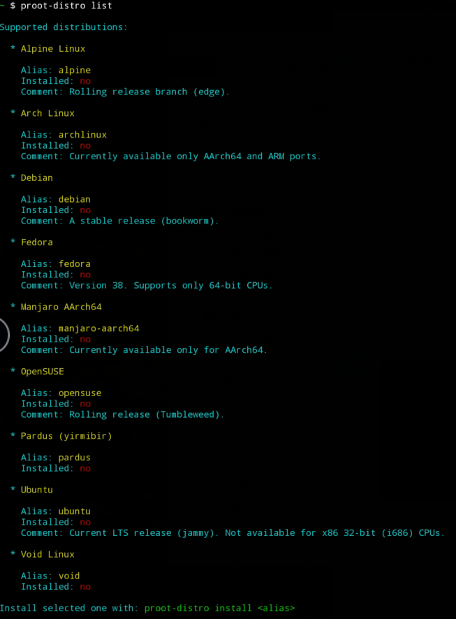

# Termux安装Linux Proot-distro发行版

## 一、Proot介绍

[Termux](https://ivonblog.com/posts/how-to-use-termux/)作为终端模拟器，能在手机上以proot安装Linux发行版，例如Ubuntu、Arch Linux、Alpine Linux、Fedora、Debian、OpenSUSE等。这里将使用手动安装方式

## 二、以proot安装Debian发行版

1. 安装Proot-distro套件

   ```bash
   pkg update
   termux-setup-storage
   pkg install proot-distro
   pkg install pulseaudio vim
   ```

2. 使用以下指令查看线上有什么发行版

   ```bash
   proot-distro list
   ```

3. 目前有Alpine Linux、Arch Linux、Debian、Fedora、openSUSE、Ubuntu、Void Linux、Pardus Linux

   

4. 假设要安装Debian，执行：

   ```bash
   proot-distro install debian
   ```

5. 下载之后，登录系统：

   ```bash
   proot-distro login debian
   ```

6. 登入后会是root账号，输入后`apt update`就可以开始安装套件了。 使用完毕输入`exit`即可退出系统。

参考[Termux安装Linux Proot-distro发行版教学 | Ivon的博客 (ivonblog.com)](https://ivonblog.com/posts/termux-proot-distro/)