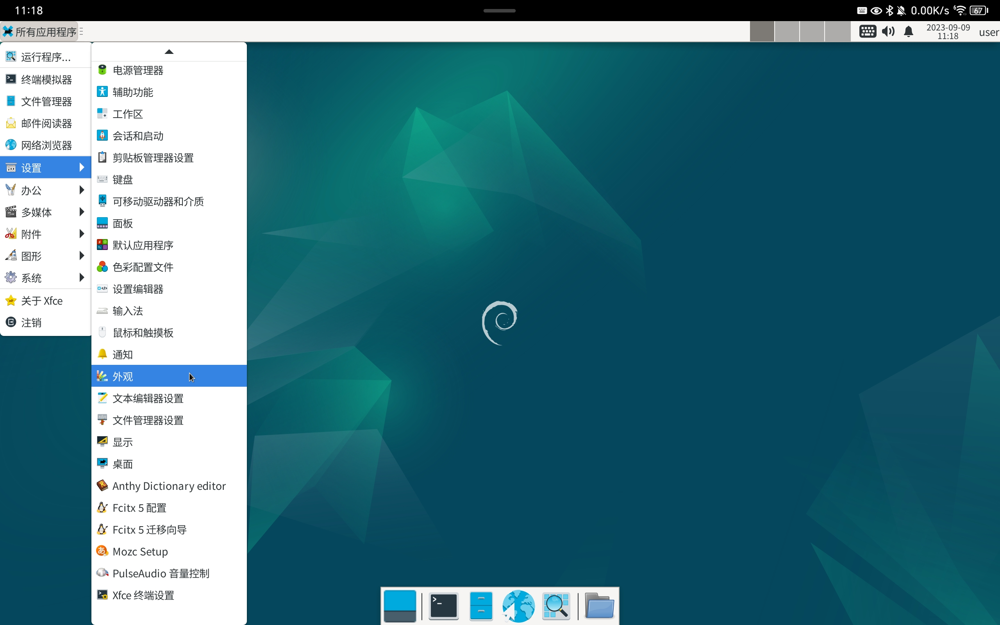
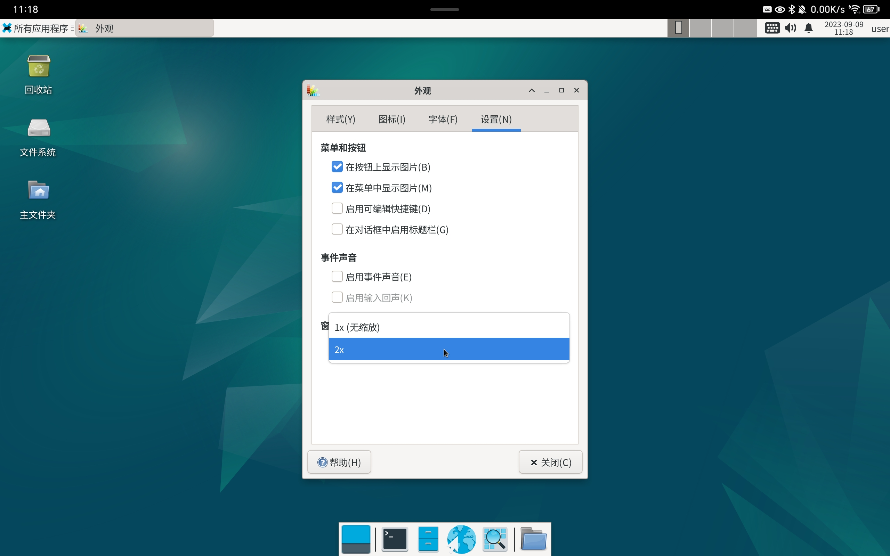
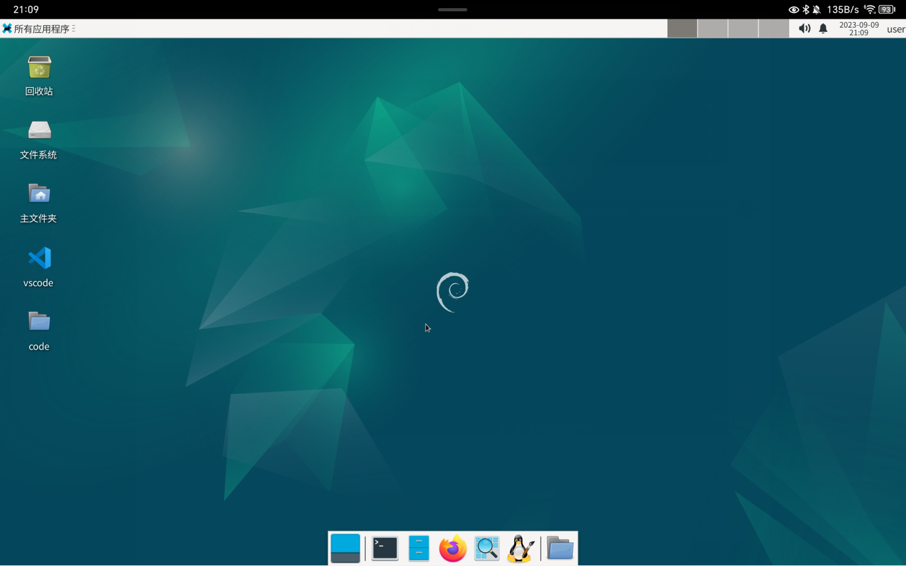
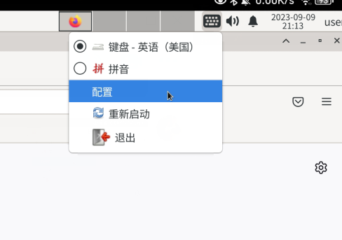
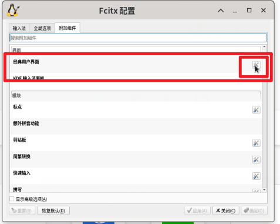
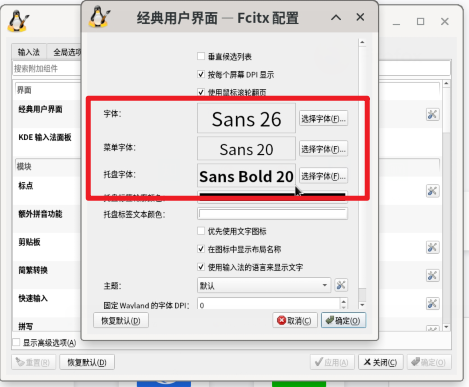

# 安装配置XFCE4桌面环境

1. 目前Termux尚无法启动GNOME桌面，KDE有点太吃资源了。 所以安装XFCE4桌面环境，很轻量，适合大多数手机使用：

   ```bash
   sudo apt install xfce4 xfce4-goodies
   ```

2. 安装时会问键盘设定，输入1选择US。

3. 配置XFCE4桌面，设定时区、中文、输入法

   ​		\* Fcitx5输入法需要外接键盘才能使用，中文和输入法可以进入图形化界面进行配置

    1. 设定时区为中国上海

       ```bash
       sudo ln -sf /usr/share/zoneinfo/Asia/Shanghai /etc/localtime
       ```

    2. 安装locales和Fcitx5输入法

       ```bash
       sudo apt install locales fcitx5* fonts-noto-cjk
       ```

    3. 配置中文环境，根据指引分别选择`zh_CN.UTF-8 UTF-8`和`zh_CN.UTF-8`

       ```shell
       sudo dpkg-reconfigure locales
       ```

    4. 用VIM编辑`.profile`，root用户和user用户都进行更改，此时登录用户为user

       ```shell
       sudo vim ~/.profile
       sudo vim /root/.profile
       ```
   
    5. 加入以下内容，解决的Fcitx5无法切换输入法的问题，重新登陆后生效
   
       ```shell
       export GTK_IM_MODULE=fcitx 
       export QT_IM_MODULE=fcitx 
       export XMODIFIERS="@im=fcitx"
       ```
   

---

*此时仍有许多问题未解决，进入图形化界面后再进行配置解决*

1. 修改界面缩放：所有应用程序 --> 外观 --> 设置 --> 缩放2x

   

   

2. 安装火狐浏览器

   ```shell
   sudo apt install firefox-esr
   ```

3. 编辑桌面图标

   

4. 修改输入法字体大小

   

   

   

参考

[Debian配置系统中文语言及环境 - 掘金 (juejin.cn)](https://juejin.cn/post/7189647325524918331)

[Debian GNU/Linux 安装手册](https://www.debian.org/releases/stable/amd64/index.zh-cn.html)

[archLinux安装fcitx输入法不能切换中文问题(已解决) _杨圣亮的技术博客 (yangshengliang.com)](https://www.yangshengliang.com/kaiyuan-shijie/linux-shijie/651.html)

[Termux如何安装Debian系统 （图形界面+中文化+音频+一键启动指令稿） | Ivon的博客 (ivonblog.com)](https://ivonblog.com/posts/termux-proot-distro-debian/)
