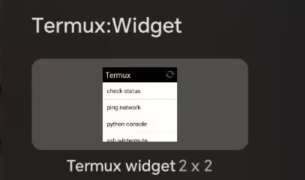
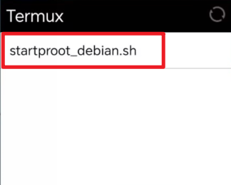
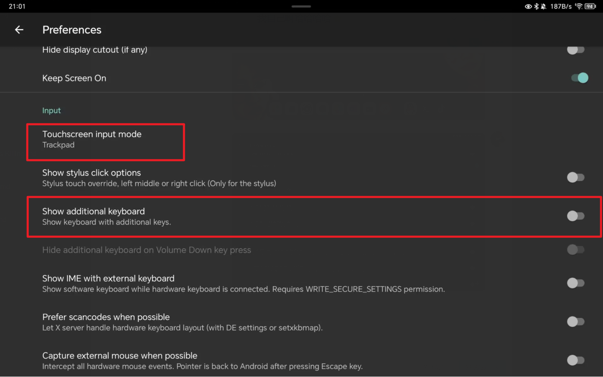

# 手动和自动进入桌面环境

## 一、手动进入桌面环境

1. 安装Debian后，将Termux和Termux X11应用程序强制停止，清除快取。 重启Termux。

2. 开启Termux X11 app，保持在背景开启。 接着回到Termux，执行PulseAudio、执行Termux X11、执行virgl server GPU加速

   ```shell
   pulseaudio --start --load="module-native-protocol-tcp auth-ip-acl=127.0.0.1 auth-anonymous=1" --exit-idle-time=-1
   pacmd load-module module-native-protocol-tcp auth-ip-acl=127.0.0.1 auth-anonymous=1
   
   export DISPLAY=:0
   termux-x11 :0 &
   
   virgl_test_server_android &
   ```

3. 登入Debian，注意这边登入的是一般帐户`user`

   ```shell
   proot-distro login debian --user user --shared-tmp
   ```

4. 在Debian中依序启动PulseAudio、桌面环境XFCE4

   ```shell
   export DISPLAY=:0
   PULSE_SERVER=tcp:127.0.0.1
   
   dbus-launch --exit-with-session startxfce4 &
   ```

5. 切换至Termux X11的画面应可看到桌面环境。

##二、一键进入桌面环境

1. 安装[Termux API](https://f-droid.org/packages/com.termux.api/)与[Termux Widget](https://f-droid.org/packages/com.termux.widget/)，下载安装，然后在Termux中安装termux-api包

   ```shell
   pkg install termux-api
   ```

2. 在应用设置中给Termux开启「允许显示在其他应用程序上层」权限

3. 使用Termux，创建shell脚本

   ```shell
   mkdir .shortcuts
   vim .shortcuts/startproot_debian.sh
   ```

4. 脚本中填入以下内容

   ```shell
   # 启动Termux X11
   termux-toast "Starting X11"
   am start --user 0 -n com.termux.x11/com.termux.x11.MainActivity
   XDG_RUNTIME_DIR=${TMPDIR}
   termux-x11 :0 -ac &
   sleep 3
   
   # 启动PulseAudio
   pulseaudio --start --load="module-native-protocol-tcp auth-ip-acl=127.0.0.1 auth-anonymous=1" --exit-idle-time=-1
   pacmd load-module module-native-protocol-tcp auth-ip-acl=127.0.0.1 auth-anonymous=1
   
   # 启动GPU加速的virglserver
   virgl_test_server_android &
   
   # 登入proot Debian
   proot-distro login debian --user user --shared-tmp -- bash -c "export DISPLAY=:0 PULSE_SERVER=tcp:127.0.0.1; dbus-launch --exit-with-session startxfce4"
   ```

5. 使用chmod命令给予执行权限

   ```shell
   chmod +x .shortcuts/startproot_debian.sh
   ```

6. 到平板桌面，新增经典小工具 → 选取Termux Widget，可以看到刚才写的捷径出现在列表中。

   

7. 点击列表中的选项，Termux 就会自动开启登录桌面了。

   

8. 在桌面上长按Termux-x11的图标，选择Preferences，可以修改底部按键和鼠标模式

   

参考

[Termux如何安装Debian系统 （图形界面+中文化+音频+一键启动指令稿） | Ivon的博客 (ivonblog.com)](https://ivonblog.com/posts/termux-proot-distro-debian/)

[termux运行shell脚本-掘金 (juejin.cn)](https://juejin.cn/s/termux运行shell脚本)